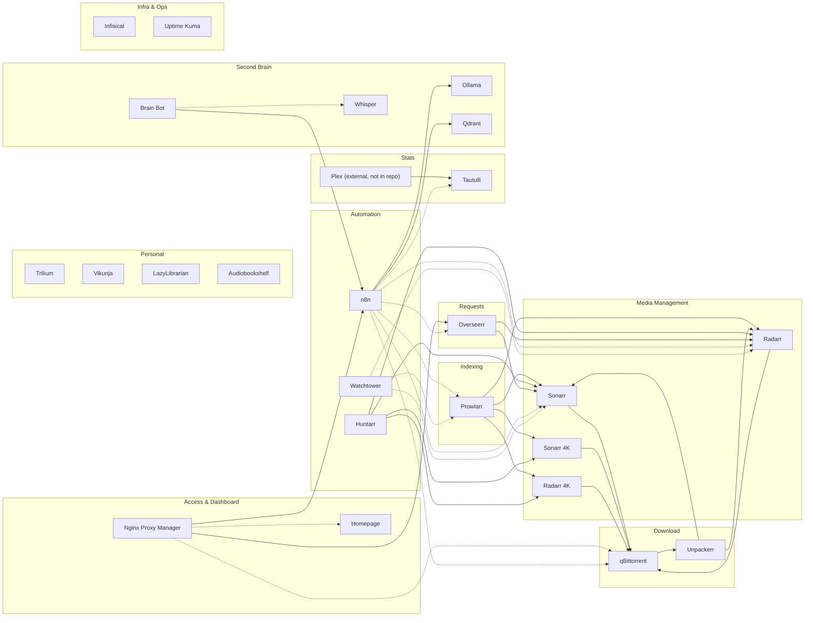

# Homelab Architecture Overview

Everything runs as Docker Compose services on a single Mac Mini (`192.168.178.69`) via OrbStack, one service directory per app at the repo root, each with its own `compose.yml`. Media libraries and downloads live on a UniFi Drive NAS (`192.168.178.38`), mounted via SMB on the macOS host and passed through into containers as bind mounts.

## Service Map

Infisical and Uptime Kuma are shown with no edges yet — both are deployed but not wired into anything else's dependency chain: Infisical is read from ad hoc by scripts (not yet by n8n directly), and Uptime Kuma has no monitors configured yet. Edges will get added here once that's real, not before.

Solid arrows are functional dependencies (data/API calls the app needs to work). Dotted arrows are n8n/Watchtower/NPM reaching in from outside — monitoring, automation, or routing rather than core function.

## Port Map

| Service | Host Port | Container Port | Notes |
|---|---|---|---|
| NPM (HTTP) | 80 | 80 | |
| NPM (HTTPS) | 443 | 443 | |
| NPM (Admin) | 81 | 81 | |
| Prowlarr | 9696 | 9696 | |
| n8n | 5678 | 5678 | |
| Trilium | 8080 | 8080 | |
| Homepage | 3000 | 3000 | |
| Overseerr | 30023 | 5055 | |
| qBittorrent WebUI | 30024 | — | `network_mode: host`, no port mapping |
| qBittorrent torrenting | 50415 | — | `network_mode: host` |
| Radarr | 30025 | 7878 | |
| Sonarr | 30027 | 8989 | |
| Sonarr 4K | 30030 | 8989 | |
| Radarr 4K | 30031 | 7878 | |
| LazyLibrarian | 30032 | 5299 | fixed 2026-08-17, was misconfigured as 30032:30032 |
| Audiobookshelf | 30033 | 30033 | |
| Vikunja | 30037 | 3456 | |
| Tautulli | 30035 | 8181 | |
| Huntarr | 30036 | 9705 | |
| Ollama | 11434 | 11434 | LAN only, no auth — do not expose publicly |
| Qdrant | 6333 | 6333 | LAN only, no auth — do not expose publicly |
| Infisical | 30034 | 8080 | LAN only, real auth (unlike Ollama/Qdrant) but holds secrets — conservative default |
| Uptime Kuma | 30038 | 3001 | LAN only for now |
| Authelia | 30039 | 9091 | SSO/OIDC provider — **requires `auth.kodyparton.com` via NPM to function**, see `sso.md` |
| Vaultwarden | 30040 | 80 | Password manager. SSO + local login both enabled (deliberate) |
| Paperless-ngx | 30041 | 8000 | Documents/OCR. SQLite + internal redis |
| AdGuard Home | 30043 (UI), 53 (DNS) | 80, 53 | LAN DNS resolver + ad blocking. Works around ISP DNS rebinding filter |
| Immich | 30042 | 2283 | Photos. Library on NAS (`/Volumes/media/immich`), not boot disk |

`brain-bot` has no listening port — outbound only (Discord Gateway + calls to n8n).

Convention: LAN-only services generally live in the `300xx` range. `30034` (formerly a gap) is now Infisical.

## Domain / Reverse Proxy Map

All via Nginx Proxy Manager (`nginx-app-1`), certs via Let's Encrypt DNS-01 through Cloudflare — a single wildcard cert (`*.kodyparton.com`) covers every subdomain, so new subdomains don't need a new cert issuance, just a new proxy host reusing the existing certificate.

| Domain | Forwards to | Status |
|---|---|---|
| `n8n.kodyparton.com` | `192.168.178.69:5678` | working |
| `request.kodyparton.com` (Overseerr) | `192.168.178.69:30023` | working |
| `downloads.kodyparton.com` (qBittorrent) | `192.168.178.69:30024` | working (corrected from a stale `10.10.0.130`, verified 2026-08-27) |
| `home.kodyparton.com` (Homepage) | `192.168.178.69:3000` | working **via AdGuard Home** — see below |
| `auth.kodyparton.com` (Authelia SSO) | `192.168.178.69:30039` | DNS resolves; **NPM proxy host still needs creating** |

**Important, learned the hard way (2026-08-27):** the internal-only hosts cannot rely on public DNS alone. A Cloudflare "DNS only" record pointing at `192.168.178.69` is correct, but the ISP/router path **silently drops DNS responses containing private IPs** (rebinding protection), so those names never resolved on the LAN. The fix is AdGuard Home (`adguard/`), which answers them locally — its response never crosses the filtering boundary. Clients must use `192.168.178.69` as their DNS server for this to take effect. Full diagnosis in `known-issues.md`.

## Data Flow (typical request lifecycle)

1. Request comes in via Overseerr (public, `request.kodyparton.com`) or is added directly in Sonarr/Radarr.
2. Sonarr/Radarr search via Prowlarr's aggregated indexers.
3. Grab sent to qBittorrent, which downloads to the shared `/Volumes/downloads` SMB share.
4. Unpackerr extracts any archive qBittorrent can't hand off directly.
5. Sonarr/Radarr import the finished file into the library (`/Volumes/media/...`).
6. Huntarr periodically re-triggers missing/upgrade searches in the background.
7. Plex (external) picks up new library files; Tautulli records what gets watched.

## Host Notes

- Container runtime is **OrbStack**, not Docker Desktop.
- Media/download storage is a UniFi Drive NAS, SMB-mounted on the macOS host and passed through OrbStack's VM into containers — this passthrough is the root cause of the mount-drop issue documented in `known-issues.md` and self-healed by n8n workflow 09.
- OrbStack's VM memory is capped at **12GB** out of this Mac's 16GB total (`orb config set memory_mib 12288`) — raised from the 8GB default after real OOM-kills in the `ollama` container (see `docs/containers/ollama.md`). Changing this restarts every container on the host (`orb stop && orb start`); all come back automatically via `restart:unless-stopped`.
