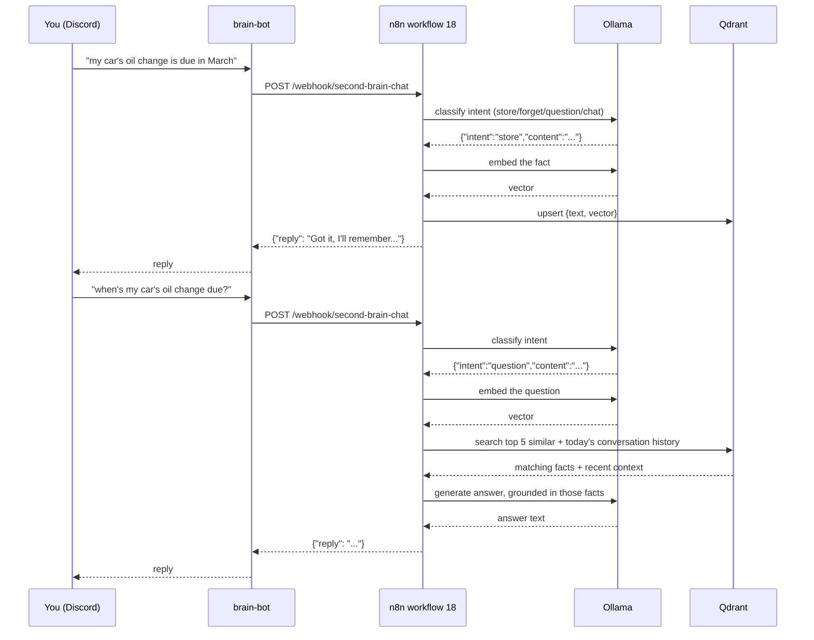

# Second Brain

A self-hosted, Discord-native knowledge assistant: chat with it to ask questions grounded in facts it's been taught, and teach it new facts the same way. Fully local — no external API calls, no per-message cost, nothing leaves this Mac.

This is a **separate system** from Kody's existing Obsidian-based second brain (the `SOUL.md`/`USER.md`/`MEMORY.md`/daily-notes system that Claude Code itself operates as, with its own Discord bot) — different bot application, different credentials, different failure domain. This one is homelab infrastructure, versioned and documented like everything else in this repo; the Obsidian one is a personal daily-driver assistant. As of 2026-08-25 there's a deliberate one-way bridge between them: this brain reads the Obsidian vault's content daily (see "Obsidian vault integration" below), but nothing writes back — the Obsidian assistant's own file management stays untouched.

## How it works



There's no required syntax — no `remember:`, no `forget:`, no command prefixes. Every message goes through an LLM classification step first that figures out what you actually mean (store a fact, forget one, ask a question, or just chat) from natural phrasing, then routes accordingly. This was a deliberate redesign (2026-08-24) away from an earlier keyword-prefix version specifically to make it feel like a conversation rather than a command line.

Four services, each documented individually:

| Service | Role |
|---|---|
| [`brain-bot`](../containers/brain-bot.md) | Discord relay — the only custom code in this stack |
| [`n8n`](../containers/n8n.md) workflow **18 - Second Brain - Chat** | Orchestration — routes ingest vs. query, calls Ollama and Qdrant |
| [`ollama`](../containers/ollama.md) | Local LLM — embeddings (`nomic-embed-text`) and chat generation (`qwen2.5:7b-instruct`) |
| [`qdrant`](../containers/qdrant.md) | Vector memory — every fact it's been taught |

## Teaching it something

Just say it naturally, no prefix needed:

> the guest wifi password is on the fridge whiteboard

An LLM classification pass (a small, fast Ollama call before the "real" processing) recognizes this as something to remember, cleans it up, embeds it, stores it in Qdrant, and confirms. `remember: ...` / `note: ...` / `save: ...` still work fine if that's how it feels natural to phrase it — the classifier isn't confused by them — but nothing requires that syntax anymore.

## Asking it something

Just ask normally:

> what's the guest wifi password?

It embeds the question, retrieves the 5 most semantically similar stored facts (only ones scoring above a relevance threshold — see `qdrant.md`) *and* the last few things said today for continuity, and asks the local LLM to answer using that context. If nothing relevant was stored, it says so rather than guessing — this was deliberately tested to confirm it doesn't hallucinate an answer when the context is empty.

## Forgetting something

Also natural language, no special syntax:

> actually forget what I said about the wifi password

The classifier extracts what you want forgotten, semantically searches for the closest matching stored fact(s) (requiring a high confidence score — 0.6+ — so it doesn't delete the wrong thing on a vague description), deletes any matches, and tells you exactly what got removed. If nothing matched confidently enough, it says so and deletes nothing rather than guessing.

## Just talking to it

Anything that isn't a fact, a question, or a forget request — greetings, reactions, small talk — gets a normal conversational reply instead of being forced through the "answer from stored facts" machinery. It still has access to the last few exchanges from today for continuity (e.g. "haha yeah" after a previous exchange makes sense to it), it just isn't required to ground the reply in retrieved memory the way a real question is.

## Sending it a photo

Any image attachment (with or without a caption) gets logged rather than answered — the bot confirms with a short "📷 saved" reply. It doesn't analyze the image itself (no vision model in the loop), just the filename and whatever caption you included. This exists primarily to feed the daily journal — see `docs/architecture/journaling.md`.

Every exchange through this bot — facts, questions, chat, photos — also gets logged with today's date, which is what makes the [daily journaling system](journaling.md) possible, and what gives it same-day conversational memory.

## Reading and writing your other self-hosted apps

As of 2026-08-25, the classifier recognizes 10 intents, not 4 — the brain can now read from and write to Vikunja, Trilium, and your media stack directly, not just its own Qdrant memory.

| You say... | Intent | What happens |
|---|---|---|
| "remind me to renew the car registration" | `task` | Creates a real task in Vikunja |
| "what tasks do I have" / "what's on my to-do list" | `list_tasks` | Lists your open Vikunja tasks, soonest-due first |
| "mark the vet call as done" / "I finished X" | `complete_task` | Finds the closest-matching open Vikunja task (via an LLM match, not string-matching) and marks it done — tells you if nothing matched confidently rather than guessing |
| "save this as a note: ..." / "write this down" | `note` | Creates a proper note in Trilium (separate from the daily journal) |
| "do I have X show/movie" / "what have I been watching" | `media_query` | Checks your **live** Sonarr/Radarr library and Tautulli watch history — not stored memory, real current data |
| "actually it's X, not Y" | `correct` | Replaces a matched stored fact with the correction in one message, instead of forget-then-store |

**`media_query`, `task`, `list_tasks`, and `complete_task` are all fully working and verified live** as of 2026-08-25 — Vikunja's API token is connected (project "Inbox"). Two Vikunja-specific bugs only surfaced once real credentials existed to test against, both fixed the same day: `Create Vikunja Task` was missing its `authentication`/`genericAuthType` parameters entirely (the credential was attached but never actually applied to the request), and `/api/v1/tasks/all` returns a 400 on this Vikunja version (v2.5.0) — switched to the project-scoped `/api/v1/projects/1/tasks` endpoint instead.

**`note` still needs one thing from you**: Trilium already has a real account (you set it up yourself), but I don't have login credentials, so I couldn't generate the ETAPI token myself. See Setup below.

### How `media_query` actually works (worth knowing)

Naively dumping your whole Sonarr+Radarr library into the prompt made even a simple yes/no question take 3+ minutes and time out — a real problem hit and fixed during testing. It now fuzzy-matches the question's meaningful words against library titles *in code* (word-boundary matching, not substring — an earlier version matched "some" inside "Awesome" and had to be fixed) before ever calling the LLM, and only sends the 5 or so most-relevant matches as context. If literally nothing matches, it skips the LLM call entirely and answers directly. This keeps it fast and keeps the model from rambling about an entire library it wasn't asked about.

## Setup steps for the new integrations

1. **Vikunja**: log into `http://192.168.178.69:30037` with your existing account → Settings → API Tokens → create one → paste it into n8n's **"Vikunja API Token"** credential as `Bearer YOUR_TOKEN`. Then pick (or create) a project for the brain to use, note its ID (visible in the URL when you open the project), and replace `YOUR_VIKUNJA_PROJECT_ID` in the **"Create Vikunja Task"** node's URL, and in **"Get Vikunja Tasks"**/**"Get Open Tasks"** if you want task listing scoped to that one project (currently they list tasks across *all* your projects, which is probably what you want, but worth knowing).
2. **Trilium**: log into `http://192.168.178.69:8080` → Options → ETAPI → Create new token → paste it into n8n's **"Trilium ETAPI"** credential (just the raw token, no prefix). Create a note to serve as the general notes parent (separate from the Journal parent note from `journaling.md`), get its note ID, and replace `YOUR_TRILIUM_NOTES_PARENT_NOTE_ID` in the **"Save Trilium Note"** node.

## Other integration opportunities identified but not built

Surveyed while building the above — these are real, feasible, just out of scope for this pass:

- **Overseerr media requests** ("add X movie to my watchlist") — would need a TMDB API key (same gap noted for workflow 13) to resolve a title to a TMDB ID before creating the Overseerr request.
- **qBittorrent download status** ("what's downloading right now") — blocked on the same qBittorrent WebUI password gap noted since the Homepage build; the API itself is straightforward once that's filled in.
- **Prowlarr indexer health via chat** ("are my indexers healthy") — low value beyond what workflow 12 already automates, deprioritized.
- **Vikunja: due-date awareness in `list_tasks`** — currently lists all open tasks sorted by due date; could be extended to a dedicated "what's overdue" filter.
- **Homepage / NPM** — not applicable; these are pure infrastructure/dashboard, not naturally "read or write data" targets for a chat assistant.

## Setting the foundation of knowledge

An empty brain isn't useful. Two ways to seed it:

**1. Bulk-load from files** (recommended for the initial foundation):

```bash
python3 scripts/seed_second_brain.py <file-or-directory>
```

Accepts `.md`/`.txt` files, chunks them on blank lines (paragraph-level, so retrieval points to specific facts rather than whole documents), embeds and stores each chunk. Safe to re-run — content-hashed IDs mean re-running on unchanged files doesn't duplicate entries.

**Already done, and kept fresh automatically**: the entire homelab documentation set (every container doc + architecture map) is in its memory. **Workflow 22 - Refresh Homelab Knowledge** re-runs this seed against `docs/` every morning at 06:00 — the script deletes-then-reinserts each file's chunks by source path, so edits to a doc replace the stale version rather than piling up duplicates, and new docs get picked up automatically. Ask it things like "what port is sonarr on" or "why does the mount keep breaking" and it answers grounded in the same docs a human would read, updated daily.

**2. Your Obsidian vault is already included, automatically** (as of 2026-08-25) — see "Obsidian vault integration" below. The same script works on any other markdown/text too — old notes, a braindump file, anything — run `python3 scripts/seed_second_brain.py <path>` yourself whenever you want more content queryable here.

**3. Ongoing, the natural way** — just keep saying `remember: ...` in Discord as things come up. That's the intended steady-state, not a one-time chore.

## Setup steps you need to perform

Everything above is built and running except the one piece that fundamentally requires your own Discord account:

1. **Create a dedicated Discord bot application** (separate from any existing bot):
   - discord.com/developers/applications → New Application → name it whatever you like (e.g. "Homelab Brain").
   - Bot tab → Reset Token → copy it. Under **Privileged Gateway Intents**, enable **Message Content Intent** (required — without it the bot can't read message text).
   - OAuth2 → URL Generator → scope `bot`, permissions `Send Messages` + `Read Message History` + `View Channel` → open the generated URL, invite it to your server.
2. **Get the channel ID** you want it to listen in: Discord → User Settings → Advanced → enable Developer Mode → right-click the channel → Copy Channel ID. (DMs to the bot work regardless of this setting.)
3. **Fill in `brain-bot/.env`** (copy from `brain-bot/.env.example` if it doesn't exist yet): `DISCORD_BOT_TOKEN` and `DISCORD_CHANNEL_IDS` (comma-separated if more than one channel).
4. **Start the bot**: `cd brain-bot && docker compose up -d --build`.
5. **Activate workflow 18** in n8n (`https://n8n.kodyparton.com` → find "18 - Second Brain - Chat" → toggle Active). n8n's API can create workflows but can't activate them — this one manual toggle is unavoidable, same as every other workflow in this stack.
6. Send it a message. If nothing happens, check `docker logs brain-bot` first (usually a bad token or the channel ID doesn't match), then n8n's execution log for workflow 18.

Voice messages work with no extra setup — `whisper` is already running and `brain-bot` already points at it.

For the Vikunja bridge (optional): complete Vikunja's first-run signup (`http://192.168.178.69:30037`), then User Settings → API Tokens → create one → paste it into n8n's **"Vikunja API Token"** credential as `Bearer YOUR_TOKEN`. Then edit the **"Create Vikunja Task"** node in workflow 18, replacing `YOUR_VIKUNJA_PROJECT_ID` in the URL with the ID of whichever Vikunja project you want tasks to land in (visible in Vikunja's UI URL when you open a project).

For workflows 19, 20, 24, and 25 (anything that posts to Discord *without* being triggered by a message — prompts, journal, reminders, digests): each needs its own "EDIT ME: Discord Channel ID" node filled in with your real channel ID, and all four share the **"Second Brain Discord Bot"** credential, which needs the same bot token as `brain-bot/.env`, formatted as `Bot YOUR_TOKEN` (that's Discord's required bot-auth header format — the literal word "Bot", a space, then the token).

## What's already been built out (formerly "extending it later")

All four originally-deferred ideas from v1 are done as of 2026-08-24:

- ✅ **Multi-turn conversation memory** — question and chat replies both pull the last 4 exchanges from today's conversation log as context.
- ✅ **Backup coverage for Qdrant** — workflow 03 now triggers a fresh snapshot before each daily backup check, kept in `qdrant/snapshots/` (a separate bind mount from `qdrant/storage/`, gitignored), retains the last 3, and `scripts/backup_check.sh` verifies one exists and isn't stale.
- ✅ **A `forget` capability** — no longer keyword-gated (see "Forgetting something" above); natural language, confidence-thresholded.
- ✅ **Feeding it live homelab state** — workflow 22, daily 06:00.

## Brainstormed ideas — now built (2026-08-24)

All 6 buildable ideas from the 2026-08-24 brainstorm are done (the 7th, correlating homelab state with journal mood, needed no build — it already works today, since both live in the same memory: just ask it something like "was I stressed the week the mount kept breaking"):

- ✅ **Vikunja bridge** — a 5th classifier intent, `task`. Say something like "remind me to renew the car registration" and it creates a real Vikunja task instead of just a fact. Setup below.
- ✅ **Memory consolidation** — workflow 23, weekly. Conversation log entries older than 30 days get summarized by the LLM into one dense point and the originals deleted, so retrieval quality doesn't degrade as history piles up. The summary is stored *before* the originals are deleted, so a mid-run failure can't lose data.
- ✅ **Proactive date-aware reminders** — workflow 24, daily 08:00. Scans every stored fact, asks the LLM which ones reference something happening today or in the next 3 days, posts a heads-up if anything matches.
- ✅ **Voice messages** — deployed [`whisper`](../containers/whisper.md) (faster-whisper, local, CPU). Any Discord voice message or audio attachment gets transcribed and fed into the normal pipeline exactly like a typed message. Verified live with a synthesized test clip.
- ✅ **Weekly digest** — workflow 25, Sunday 18:00. "What I learned about you this week" from the week's new facts and conversations.
- ✅ **Full memory export** — `scripts/export_second_brain.py`, dumps every point to a readable markdown file grouped by type. Run it yourself whenever (`python3 scripts/export_second_brain.py [output-path]`) — not scheduled, since it's for on-demand browsing/backup, not something that needs to run unattended.

## Ideas not yet built

- **Vision-capable photo understanding** — ❌ tried 2026-08-25, abandoned. Pulled `moondream` (1B params, chosen specifically for being tiny) and tested it directly against Ollama with a real image. Image encoding was fine, but text generation ran at 0.49 tokens/sec with the 7B classify/generate model and the embedding model also loaded — a one-sentence description didn't finish in under 4:40. Not the vision model's fault; it's CPU contention from 3 concurrently-loaded models on this hardware's ~8 cores. Photos are still logged by filename/caption only. Revisit only with better hardware, or if there's ever a reason to let the 7B model unload while photos are processed (which would slow down concurrent text messages instead — not free).
- **Cross-channel/cross-user conversation isolation** — recent-history lookups currently filter by date only, not by Discord channel or author. Fine for a single-user bot in one channel (the deployed setup), but if `brain-bot` ever listens in multiple channels or multiple people talk to it, conversations would blend together. Would need `channel_id`/`author_id` added to the conversation log payload (they're already sent by the bot, just not stored yet) and filtered on.
- ~~**Explicit fact correction**~~ — ✅ built 2026-08-25, see "Robustness pass" below.

## Obsidian vault integration (2026-08-25)

**Done, read-only, automatic.** `~/Obsidian/KodyBrain` — Kody's other, Obsidian-based second brain (`SOUL.md`/`USER.md`/`MEMORY.md`/`HABITS.md`/daily notes) — is now seeded into this brain's memory too, kept fresh by **workflow 26 - Refresh Obsidian Knowledge** (daily 06:15, 15 minutes after the homelab docs refresh so they don't contend for Ollama at the same time). Same mechanism as the docs refresh: `scripts/seed_second_brain.py ~/Obsidian/KodyBrain`, delete-by-source-then-reinsert, so edited vault notes replace their stale version rather than duplicating.

What this means in practice: ask the Discord bot something like "what are my habit pillars" or "what did I decide about X" and it can answer from the Obsidian vault's content, not just what you've told it directly in Discord. Verified live — a semantic search for "what are my habit pillars" correctly surfaced the exact `HABITS.md` pillar list.

**Deliberately read-only — nothing writes back to the vault.** Kody's Obsidian-based assistant has its own file-organization logic and explicit rules about what touches that vault (see its `SOUL.md`: "Never modify files outside `~/Obsidian/KodyBrain/` or `.claude/`"). Having a second, independent system also writing into the same vault risks real conflicts — competing file-naming conventions, race conditions if both write around the same time, one system's note-organization logic fighting the other's. If two-way sync (e.g., the `note` intent writing to Obsidian instead of/alongside Trilium) is ever wanted, it should be a deliberate, separately-considered decision, not a side effect of this read sync.

**One gap worth knowing**: the vault is small right now (68KB, 12 files, mostly the same profile/memory files that already show up in Claude Code's own context each session) — daily notes and any Journal/Research/Family/Projects content that gets added later will get picked up automatically by the daily refresh, no action needed.

## Robustness pass (2026-08-25)

A 10-item brainstorm on making the second brain more reliable, not just more capable. Nine of ten got built; one was tried and deliberately abandoned once real measurements said it wouldn't help.

- ❌ **Tried and abandoned: a smaller/faster classify model.** Pulled `qwen2.5:1.5b-instruct` (5x fewer params than the 7B model in use) and load-tested it directly against Ollama. Two separate calls both took ~50s — statistically the same as the 7B model — while pegging ~6 CPU cores the whole time. On this Mac's CPU-only inference, single-request latency is dominated by prefill/JSON-grammar-decode overhead and memory bandwidth, not raw parameter count, so a smaller model doesn't give a proportional speedup here. Model removed to reclaim disk space. While investigating this, measured a real "chat" round trip (classify + generate, both against the 7B model) at **2:43** under light concurrent load — corrected the user guide's old "~30 seconds" claim, which was optimistic. See `known-issues.md`.
- ✅ **Caching repeated questions.** Every non-photo message is now hashed and checked against a `qa_cache` Qdrant collection *before* the classifier ever runs. An exact repeat of a previously-asked question gets its cached answer back near-instantly instead of paying for another classify+generate round trip. The cache is invalidated wholesale (all entries cleared) any time a `store` or `forget` completes, so a fact changing can't leave a stale cached answer behind. Only the `question` intent writes to the cache — `chat` replies are intentionally not cached, since a repeated greeting getting the exact same canned reply every time would feel robotic rather than helpful.
- ✅ **Self-test workflow** — workflow 28, daily 05:00. Fires 6 canned messages through the intents that are safe to repeat automatically (`chat`, `question`, a self-cleaning `store`+`forget` pair using a uniquely-timestamped marker fact, `list_tasks`, `media_query`) and posts a Discord summary only if something fails or is unreasonably slow (>240s). Deliberately excludes `task`, `complete_task`, and `note` — a daily automated test firing those would create real clutter in Vikunja/Trilium every single day. Can also be run on-demand from n8n's UI.
- ✅ **Health-check workflow** — workflow 27, every 15 minutes. Checks Ollama/Qdrant/Whisper's APIs directly and `docker ps` for all four second-brain containers; posts to Discord if anything's down. Repeats every 15 min until resolved (no dedup, matching every other alerting workflow in this stack).
- ✅ **`!status` now reports brain health too** — workflow 17 does the same three API checks inline and prepends a one-line "Second Brain: ✅/⚠️" summary to its existing `docker ps` dump, so you don't have to parse container names to tell if the brain specifically is healthy.
- ✅ **Undo/shadow log for destructive actions.** Before `forget` deletes a fact or `complete_task` marks a Vikunja task done, the full original record gets snapshotted into a new `shadow_log` Qdrant collection first. Nothing is truly gone the moment it's actioned — it's recoverable by hand (re-upsert from the shadow log entry) if something got matched wrongly. Workflow 30 (weekly, Sunday 19:00) digests the week's shadow-log activity to Discord as a lightweight audit trail, and prunes entries older than 90 days so the log doesn't grow forever. Verified live: stored a test fact, forgot it, confirmed both the shadow-log snapshot and the actual deletion happened correctly.
- ✅ **Near-duplicate fact detection** — workflow 29, weekly Saturday 05:00. Pure vector-similarity scan (no LLM calls, so it's fast and cheap) across every stored fact; any pair scoring ≥92% similarity gets posted to Discord for manual review. Deliberately **report-only, never auto-merges or auto-deletes** — a false-positive automated merge on a fact is a worse failure mode (silent, hard-to-notice data loss) than a false positive in a digest the user glances at once a week.
- ✅ **`continueOnFail` resilience** on every integration call that hits something other than Ollama/Qdrant (Vikunja task create/list/complete, Trilium note save, Sonarr/Radarr/Tautulli reads for `media_query`) — if one of those services is down, the affected branch now says so plainly ("I couldn't reach Vikunja right now") instead of the whole webhook silently erroring out with no reply.
- ✅ **Higher confidence bar for destructive actions.** `forget`'s vector-search threshold raised from 0.6 to 0.75, and it now only ever acts on the single best match instead of up to 3 — reduces both false-positive deletes and the (worse) risk of one ambiguous command deleting multiple unrelated facts at once. `complete_task`'s LLM match now also returns a confidence score and requires ≥0.7 to act, instead of a bare match/no-match judgment call. Combined with the shadow log above: the design choice here is "raise the bar and make mistakes reversible" rather than "ask the user to confirm twice," since a real confirm-then-act round trip would cost two multi-minute LLM calls back to back on this hardware.
- ✅ **Troubleshooting runbook** — `docs/architecture/troubleshooting-second-brain.md`. What to check, in order, when the bot goes quiet or errors: containers up, workflow 18 active, Ollama actually the bottleneck (usually is), OOM/OrbStack memory, disk space, n8n's execution log, the self-test workflow, brain-bot's own logs.

Also extended workflow 03's Qdrant snapshotting to cover the new `shadow_log` collection alongside `second_brain` (same daily-snapshot, keep-last-3 pattern) — an undo log that can itself be lost on a bad restore isn't much of a safety net. `qa_cache` is deliberately **not** backed up: it's a pure derived cache, losing it just means the next few questions are slow again while it repopulates, no actual data at risk.

**A bug the live-testing caught, worth remembering**: n8n webhook data lives under `$json.body.*`, not `$json.*` — the new cache-check nodes originally read `$json.content` directly and silently hashed an empty string every time. Worse, on a cache miss the node feeding back into `Classify Intent` was carrying the *cache lookup's* output forward instead of the original message, so `Classify Intent`'s prompt-building expression (`$json.body.content`) crashed on `undefined` and the whole webhook returned an empty 200 in under 100ms — easy to mistake for "it's not even trying" rather than a data-shape bug. Found via the same debug-tap-a-`respondToWebhook`-node-at-each-step technique used earlier in this project, fixed with an explicit "Restore Original Data" node that re-reads from `Cache Key`'s output by name before handing off to `Classify Intent`.

## Vikunja connected + more robustness (2026-08-25, later same day)

- ✅ **Vikunja is fully connected and verified live.** A real personal access token replaced the placeholder credential; `task`, `list_tasks`, and `complete_task` were all tested end-to-end against real data (create, list, mark-done). Doing this surfaced two more real bugs invisible until a real token existed to test against — see `known-issues.md` (`Create Vikunja Task` missing auth params; `/api/v1/tasks/all` returning 400 on Vikunja v2.5.0, switched to the project-scoped endpoint).
- ✅ **Keyword fast-path.** Unambiguous phrasing ("remember...", "forget...", "remind me to...", exact task-list phrasings) now skips `Classify Intent` entirely via a conservative regex check, still routing through the same `Parse Intent`/`Route by Intent` chain everything else uses (so none of the ~20 downstream nodes that reference `Parse Intent` by name needed to change). Since `store`/`forget`/`task` never needed a second "generate" LLM call anyway, this turns their ~2-3 minute round trip into **1-4 seconds** — verified live for all four fast-pathed intents. Anything that doesn't match a pattern falls through to the full classifier unchanged, so ambiguous phrasing is never at risk of misrouting.
- ✅ **`correct` intent.** A 10th classifier intent for "actually it's X, not Y" style corrections — finds the closest matching old fact (same 0.75-confidence, shadow-logged pattern as `forget`) and replaces it with the new one in a single message, instead of a separate forget-then-store. Not covered by the keyword fast-path (too much genuine ambiguity in how corrections get phrased to risk a regex match), so it still pays the full classify cost — but so does a manual forget-then-store today, and this is one message instead of two.
- ❌ **Vision-capable photos, tried and abandoned** — see `known-issues.md` and "Ideas not yet built" above. Confirmed via direct measurement (0.49 tokens/sec) that CPU contention from running a 3rd model concurrently with the classify/generate and embedding models makes this impractical on current hardware, independent of how small the vision model is.

## Tagging (2026-08-25, later still)

Every point in `second_brain` now carries a `domain` (`homelab`/`personal`/`obsidian`/`test`) and up to 3 `tags` from a fixed, documented vocabulary — see `docs/architecture/tagging.md` for the full scheme and reasoning. Two parts:

- **Backfill**: `scripts/tag_second_brain.py` tagged all 434 existing points — rule-based (source path → domain/tags) for the 412 doc-seeded points, one batched LLM call for the 22 Discord-originated facts/conversations (batched rather than one call each, since 22 individual CPU-bound calls would take far longer than one call tagging all 22 at once).
- **Going forward**: `Classify Intent` now also returns `tags` as part of its existing JSON output — no extra LLM call, since it already has to read the message anyway. `Parse Intent` validates against the fixed vocabulary (anything not on the list gets dropped, not stored) and computes `domain` from whether the message came from the self-test workflow (`author_id: "self-test"` → `test`) or a real user (`personal`). Fast-pathed messages get a small deterministic tag guess instead of nothing. All 14 nodes that write into `second_brain` were updated to include both fields. Explicitly **not** applied to `qa_cache` or `shadow_log` — those aren't "memory" in the sense being organized here, one's a pure latency cache and the other's an audit trail.

This does **not** touch `~/Obsidian/KodyBrain` — tagging is scoped to this project's own Qdrant memory only, per the same read-only boundary as the rest of this section. If the Obsidian vault ever needs its own tags, that's its own assistant's call to make, in its own vault.

**A genuine new bug found while testing this**: with several things hitting Ollama at once (a live chat test, plus the batch tagging call, plus a doc re-seed all running concurrently — self-inflicted, from testing several things back to back), a `Generate Chat Reply` call hit Ollama's own internal 3-minute request timeout and came back `500`. None of the five core LLM-calling nodes (`Classify Intent`, `Generate Answer`, `Generate Chat Reply`, `Generate Media Answer`, `Match Task via LLM`) had `continueOnFail` set, so the whole webhook execution died with **zero reply at all** — worse than the slow-but-working baseline, because from the user's side it looks like the bot silently ignored them. Fixed: all five now have `continueOnFail: true`, and the three respond nodes that read their output directly (`Respond (Question)`, `Respond (Chat)`, `Respond (Media)`) fall back to *"I'm having trouble thinking right now (the model timed out) — try that again in a moment"* instead of an empty response. `Classify Intent` failing already degraded gracefully for free, since `Parse Intent`'s existing try/catch treats a missing/malformed response the same as any other parse failure (falls back to `question` intent). Also learned from this: **batching multiple items into one LLM call for the tagging backfill script doesn't save time on this hardware** — wall-clock cost is dominated by *output* tokens at this hardware's measured ~0.42 tokens/sec generation rate, not by call count, so a single 23-item batch needing ~700+ output tokens would have taken 25+ minutes and kept blowing past every timeout tried. Switched to batches of 5, which finish reliably within a few minutes each and let partial progress survive if a later batch fails.

**Two more stale-`$json`-reference bugs found the same way as the `forget` one earlier today**: `Log Shadow (Complete Task)` was inserted between `Get Task By ID` and `Mark Done Locally`, so `Mark Done Locally`'s `$json` was the shadow-log write's response instead of the actual task — the confirmation message showed `"Marked done: \"undefined\""` and the real Vikunja update never actually applied. And `Write Cache` (inserted between `Generate Answer` and `Embed Exchange` for the caching feature) meant `Embed Exchange` was embedding "A: undefined" into every `question`-intent conversation log instead of the real answer — silent, no visible symptom, only caught by explicitly checking what `Embed Exchange` reads. Both fixed by switching to named node references (`$('Get Task By ID').first().json`, `$('Generate Answer').first().json.response`) instead of the ambient `$json`. **Pattern to watch going forward**: any time a new node gets inserted into an existing chain, grep for what the *next* node's code reads via bare `$json` — if it's not the new node's own output, it needs a named reference instead.
