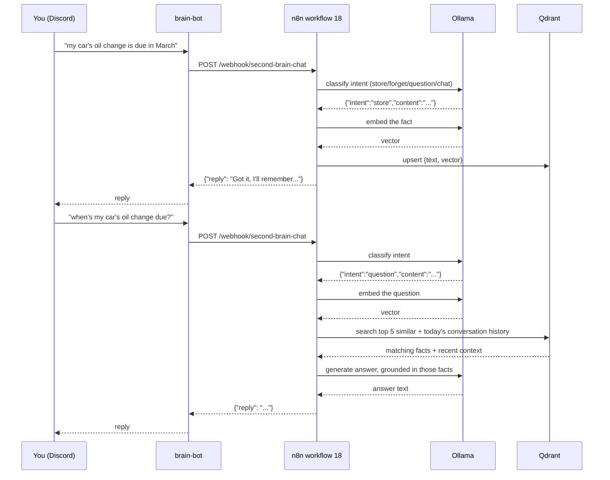

# Second Brain

A self-hosted, Discord-native knowledge assistant: chat with it to ask questions grounded in facts it's been taught, and teach it new facts the same way. Fully local — no external API calls, no per-message cost, nothing leaves this Mac.

This is a **separate system** from Kody's existing Obsidian-based second brain (the `SOUL.md`/`USER.md`/`MEMORY.md`/daily-notes system that Claude Code itself operates as, with its own Discord bot). The two are deliberately not merged — different bot application, different credentials, different failure domain. This one is homelab infrastructure, versioned and documented like everything else in this repo; the Obsidian one is a personal daily-driver assistant. They can absolutely be pointed at each other later (e.g., feed the Obsidian vault into this one's memory) but that's an opt-in step, not automatic.

## How it works



There's no required syntax — no `remember:`, no `forget:`, no command prefixes. Every message goes through an LLM classification step first that figures out what you actually mean (store a fact, forget one, ask a question, or just chat) from natural phrasing, then routes accordingly. This was a deliberate redesign (2026-08-24) away from an earlier keyword-prefix version specifically to make it feel like a conversation rather than a command line.

Four services, each documented individually:

| Service | Role |
|---|---|
| [`brain-bot`](../containers/brain-bot.md) | Discord relay — the only custom code in this stack |
| [`n8n`](../containers/n8n.md) workflow **18 - Second Brain - Chat** | Orchestration — routes ingest vs. query, calls Ollama and Qdrant |
| [`ollama`](../containers/ollama.md) | Local LLM — embeddings (`nomic-embed-text`) and chat generation (`qwen2.5:7b-instruct`) |
| [`qdrant`](../containers/qdrant.md) | Vector memory — every fact it's been taught |

## Teaching it something

Just say it naturally, no prefix needed:

> the guest wifi password is on the fridge whiteboard

An LLM classification pass (a small, fast Ollama call before the "real" processing) recognizes this as something to remember, cleans it up, embeds it, stores it in Qdrant, and confirms. `remember: ...` / `note: ...` / `save: ...` still work fine if that's how it feels natural to phrase it — the classifier isn't confused by them — but nothing requires that syntax anymore.

## Asking it something

Just ask normally:

> what's the guest wifi password?

It embeds the question, retrieves the 5 most semantically similar stored facts (only ones scoring above a relevance threshold — see `qdrant.md`) *and* the last few things said today for continuity, and asks the local LLM to answer using that context. If nothing relevant was stored, it says so rather than guessing — this was deliberately tested to confirm it doesn't hallucinate an answer when the context is empty.

## Forgetting something

Also natural language, no special syntax:

> actually forget what I said about the wifi password

The classifier extracts what you want forgotten, semantically searches for the closest matching stored fact(s) (requiring a high confidence score — 0.6+ — so it doesn't delete the wrong thing on a vague description), deletes any matches, and tells you exactly what got removed. If nothing matched confidently enough, it says so and deletes nothing rather than guessing.

## Just talking to it

Anything that isn't a fact, a question, or a forget request — greetings, reactions, small talk — gets a normal conversational reply instead of being forced through the "answer from stored facts" machinery. It still has access to the last few exchanges from today for continuity (e.g. "haha yeah" after a previous exchange makes sense to it), it just isn't required to ground the reply in retrieved memory the way a real question is.

## Sending it a photo

Any image attachment (with or without a caption) gets logged rather than answered — the bot confirms with a short "📷 saved" reply. It doesn't analyze the image itself (no vision model in the loop), just the filename and whatever caption you included. This exists primarily to feed the daily journal — see `docs/architecture/journaling.md`.

Every exchange through this bot — facts, questions, chat, photos — also gets logged with today's date, which is what makes the [daily journaling system](journaling.md) possible, and what gives it same-day conversational memory.

## Reading and writing your other self-hosted apps

As of 2026-08-25, the classifier recognizes 9 intents, not 4 — the brain can now read from and write to Vikunja, Trilium, and your media stack directly, not just its own Qdrant memory.

| You say... | Intent | What happens |
|---|---|---|
| "remind me to renew the car registration" | `task` | Creates a real task in Vikunja |
| "what tasks do I have" / "what's on my to-do list" | `list_tasks` | Lists your open Vikunja tasks, soonest-due first |
| "mark the vet call as done" / "I finished X" | `complete_task` | Finds the closest-matching open Vikunja task (via an LLM match, not string-matching) and marks it done — tells you if nothing matched confidently rather than guessing |
| "save this as a note: ..." / "write this down" | `note` | Creates a proper note in Trilium (separate from the daily journal) |
| "do I have X show/movie" / "what have I been watching" | `media_query` | Checks your **live** Sonarr/Radarr library and Tautulli watch history — not stored memory, real current data |

**`media_query` is fully working right now** — no new credentials needed, it reuses the same Sonarr/Radarr/Tautulli API keys already configured elsewhere in this repo. Verified live: asked "do I have House of the Dragon in my library" and got back the correct answer with real episode-download counts.

**`list_tasks`, `complete_task`, and `note` are built but need one thing from you first**: Vikunja and Trilium already have real accounts (you set them up yourself), but I don't have login credentials for either, so I couldn't generate the API tokens myself. See Setup below.

### How `media_query` actually works (worth knowing)

Naively dumping your whole Sonarr+Radarr library into the prompt made even a simple yes/no question take 3+ minutes and time out — a real problem hit and fixed during testing. It now fuzzy-matches the question's meaningful words against library titles *in code* (word-boundary matching, not substring — an earlier version matched "some" inside "Awesome" and had to be fixed) before ever calling the LLM, and only sends the 5 or so most-relevant matches as context. If literally nothing matches, it skips the LLM call entirely and answers directly. This keeps it fast and keeps the model from rambling about an entire library it wasn't asked about.

## Setup steps for the new integrations

1. **Vikunja**: log into `http://192.168.178.69:30037` with your existing account → Settings → API Tokens → create one → paste it into n8n's **"Vikunja API Token"** credential as `Bearer YOUR_TOKEN`. Then pick (or create) a project for the brain to use, note its ID (visible in the URL when you open the project), and replace `YOUR_VIKUNJA_PROJECT_ID` in the **"Create Vikunja Task"** node's URL, and in **"Get Vikunja Tasks"**/**"Get Open Tasks"** if you want task listing scoped to that one project (currently they list tasks across *all* your projects, which is probably what you want, but worth knowing).
2. **Trilium**: log into `http://192.168.178.69:8080` → Options → ETAPI → Create new token → paste it into n8n's **"Trilium ETAPI"** credential (just the raw token, no prefix). Create a note to serve as the general notes parent (separate from the Journal parent note from `journaling.md`), get its note ID, and replace `YOUR_TRILIUM_NOTES_PARENT_NOTE_ID` in the **"Save Trilium Note"** node.

## Other integration opportunities identified but not built

Surveyed while building the above — these are real, feasible, just out of scope for this pass:

- **Overseerr media requests** ("add X movie to my watchlist") — would need a TMDB API key (same gap noted for workflow 13) to resolve a title to a TMDB ID before creating the Overseerr request.
- **qBittorrent download status** ("what's downloading right now") — blocked on the same qBittorrent WebUI password gap noted since the Homepage build; the API itself is straightforward once that's filled in.
- **Prowlarr indexer health via chat** ("are my indexers healthy") — low value beyond what workflow 12 already automates, deprioritized.
- **Vikunja: due-date awareness in `list_tasks`** — currently lists all open tasks sorted by due date; could be extended to a dedicated "what's overdue" filter.
- **Homepage / NPM** — not applicable; these are pure infrastructure/dashboard, not naturally "read or write data" targets for a chat assistant.

## Setting the foundation of knowledge

An empty brain isn't useful. Two ways to seed it:

**1. Bulk-load from files** (recommended for the initial foundation):

```bash
python3 scripts/seed_second_brain.py <file-or-directory>
```

Accepts `.md`/`.txt` files, chunks them on blank lines (paragraph-level, so retrieval points to specific facts rather than whole documents), embeds and stores each chunk. Safe to re-run — content-hashed IDs mean re-running on unchanged files doesn't duplicate entries.

**Already done, and kept fresh automatically**: the entire homelab documentation set (every container doc + architecture map) is in its memory. **Workflow 22 - Refresh Homelab Knowledge** re-runs this seed against `docs/` every morning at 06:00 — the script deletes-then-reinserts each file's chunks by source path, so edits to a doc replace the stale version rather than piling up duplicates, and new docs get picked up automatically. Ask it things like "what port is sonarr on" or "why does the mount keep breaking" and it answers grounded in the same docs a human would read, updated daily.

**2. Point it at more of your life, if you want to.** The script works on any markdown/text — the Obsidian vault (`~/Obsidian/KodyBrain`), old notes, a braindump file, anything. This is a deliberate choice to leave to you rather than something done automatically: run `python3 scripts/seed_second_brain.py ~/Obsidian/KodyBrain` yourself whenever you want that content queryable here too. Nothing about this stack reaches into that vault on its own.

**3. Ongoing, the natural way** — just keep saying `remember: ...` in Discord as things come up. That's the intended steady-state, not a one-time chore.

## Setup steps you need to perform

Everything above is built and running except the one piece that fundamentally requires your own Discord account:

1. **Create a dedicated Discord bot application** (separate from any existing bot):
   - discord.com/developers/applications → New Application → name it whatever you like (e.g. "Homelab Brain").
   - Bot tab → Reset Token → copy it. Under **Privileged Gateway Intents**, enable **Message Content Intent** (required — without it the bot can't read message text).
   - OAuth2 → URL Generator → scope `bot`, permissions `Send Messages` + `Read Message History` + `View Channel` → open the generated URL, invite it to your server.
2. **Get the channel ID** you want it to listen in: Discord → User Settings → Advanced → enable Developer Mode → right-click the channel → Copy Channel ID. (DMs to the bot work regardless of this setting.)
3. **Fill in `brain-bot/.env`** (copy from `brain-bot/.env.example` if it doesn't exist yet): `DISCORD_BOT_TOKEN` and `DISCORD_CHANNEL_IDS` (comma-separated if more than one channel).
4. **Start the bot**: `cd brain-bot && docker compose up -d --build`.
5. **Activate workflow 18** in n8n (`https://n8n.kodyparton.com` → find "18 - Second Brain - Chat" → toggle Active). n8n's API can create workflows but can't activate them — this one manual toggle is unavoidable, same as every other workflow in this stack.
6. Send it a message. If nothing happens, check `docker logs brain-bot` first (usually a bad token or the channel ID doesn't match), then n8n's execution log for workflow 18.

Voice messages work with no extra setup — `whisper` is already running and `brain-bot` already points at it.

For the Vikunja bridge (optional): complete Vikunja's first-run signup (`http://192.168.178.69:30037`), then User Settings → API Tokens → create one → paste it into n8n's **"Vikunja API Token"** credential as `Bearer YOUR_TOKEN`. Then edit the **"Create Vikunja Task"** node in workflow 18, replacing `YOUR_VIKUNJA_PROJECT_ID` in the URL with the ID of whichever Vikunja project you want tasks to land in (visible in Vikunja's UI URL when you open a project).

For workflows 19, 20, 24, and 25 (anything that posts to Discord *without* being triggered by a message — prompts, journal, reminders, digests): each needs its own "EDIT ME: Discord Channel ID" node filled in with your real channel ID, and all four share the **"Second Brain Discord Bot"** credential, which needs the same bot token as `brain-bot/.env`, formatted as `Bot YOUR_TOKEN` (that's Discord's required bot-auth header format — the literal word "Bot", a space, then the token).

## What's already been built out (formerly "extending it later")

All four originally-deferred ideas from v1 are done as of 2026-08-24:

- ✅ **Multi-turn conversation memory** — question and chat replies both pull the last 4 exchanges from today's conversation log as context.
- ✅ **Backup coverage for Qdrant** — workflow 03 now triggers a fresh snapshot before each daily backup check, kept in `qdrant/snapshots/` (a separate bind mount from `qdrant/storage/`, gitignored), retains the last 3, and `scripts/backup_check.sh` verifies one exists and isn't stale.
- ✅ **A `forget` capability** — no longer keyword-gated (see "Forgetting something" above); natural language, confidence-thresholded.
- ✅ **Feeding it live homelab state** — workflow 22, daily 06:00.

## Extending it further

Ideas not yet built:

- **Vision-capable photo understanding** — currently photos are logged by filename/caption only, the LLM never looks at pixel content. Would need a vision model (e.g. `llava`, `qwen2.5vl`) — untested whether this hardware (M1, 16GB, already running one 7B model) can comfortably run two models loaded at once; worth a memory-usage test before committing to it.
- **Cross-channel/cross-user conversation isolation** — recent-history lookups currently filter by date only, not by Discord channel or author. Fine for a single-user bot in one channel (the deployed setup), but if `brain-bot` ever listens in multiple channels or multiple people talk to it, conversations would blend together. Would need `channel_id`/`author_id` added to the conversation log payload (they're already sent by the bot, just not stored yet) and filtered on.
- **Explicit fact correction** — right now updating a fact means forgetting the old one and stating the new one as two separate messages. A natural "actually it's X, not Y" in one message would need the classifier to support a fifth intent (`correct`) that does a search-and-replace in one step.
- **Feeding it the Obsidian vault** — still an explicit opt-in the user runs themselves (see above), not automated, by design.

## Brainstormed ideas — now built (2026-08-24)

All 6 buildable ideas from the 2026-08-24 brainstorm are done (the 7th, correlating homelab state with journal mood, needed no build — it already works today, since both live in the same memory: just ask it something like "was I stressed the week the mount kept breaking"):

- ✅ **Vikunja bridge** — a 5th classifier intent, `task`. Say something like "remind me to renew the car registration" and it creates a real Vikunja task instead of just a fact. Setup below.
- ✅ **Memory consolidation** — workflow 23, weekly. Conversation log entries older than 30 days get summarized by the LLM into one dense point and the originals deleted, so retrieval quality doesn't degrade as history piles up. The summary is stored *before* the originals are deleted, so a mid-run failure can't lose data.
- ✅ **Proactive date-aware reminders** — workflow 24, daily 08:00. Scans every stored fact, asks the LLM which ones reference something happening today or in the next 3 days, posts a heads-up if anything matches.
- ✅ **Voice messages** — deployed [`whisper`](../containers/whisper.md) (faster-whisper, local, CPU). Any Discord voice message or audio attachment gets transcribed and fed into the normal pipeline exactly like a typed message. Verified live with a synthesized test clip.
- ✅ **Weekly digest** — workflow 25, Sunday 18:00. "What I learned about you this week" from the week's new facts and conversations.
- ✅ **Full memory export** — `scripts/export_second_brain.py`, dumps every point to a readable markdown file grouped by type. Run it yourself whenever (`python3 scripts/export_second_brain.py [output-path]`) — not scheduled, since it's for on-demand browsing/backup, not something that needs to run unattended.

## Ideas not yet built

- **Vision-capable photo understanding** — currently photos are logged by filename/caption only, the LLM never looks at pixel content. Would need a vision model (e.g. `llava`, `qwen2.5vl`) — untested whether this hardware (M1, 16GB, already running Ollama's 7B model *and* Whisper) can comfortably run a third model; worth a memory-usage test before committing to it.
- **Cross-channel/cross-user conversation isolation** — recent-history lookups currently filter by date only, not by Discord channel or author. Fine for a single-user bot in one channel (the deployed setup), but if `brain-bot` ever listens in multiple channels or multiple people talk to it, conversations would blend together. Would need `channel_id`/`author_id` added to the conversation log payload (they're already sent by the bot, just not stored yet) and filtered on.
- **Explicit fact correction** — right now updating a fact means forgetting the old one and stating the new one as two separate messages. A natural "actually it's X, not Y" in one message would need a 6th classifier intent (`correct`) that does a search-and-replace in one step.
- **Feeding it the Obsidian vault** — still an explicit opt-in the user runs themselves (see above), not automated, by design.
