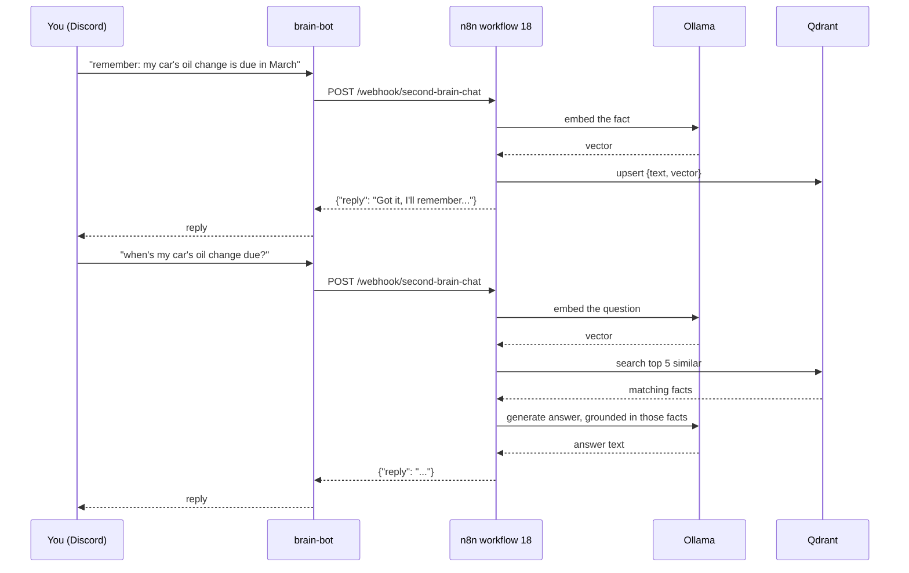

# Second Brain

A self-hosted, Discord-native knowledge assistant: chat with it to ask questions grounded in facts it's been taught, and teach it new facts the same way. Fully local — no external API calls, no per-message cost, nothing leaves this Mac.

This is a **separate system** from Kody's existing Obsidian-based second brain (the `SOUL.md`/`USER.md`/`MEMORY.md`/daily-notes system that Claude Code itself operates as, with its own Discord bot). The two are deliberately not merged — different bot application, different credentials, different failure domain. This one is homelab infrastructure, versioned and documented like everything else in this repo; the Obsidian one is a personal daily-driver assistant. They can absolutely be pointed at each other later (e.g., feed the Obsidian vault into this one's memory) but that's an opt-in step, not automatic.

## How it works



Four services, each documented individually:

| Service | Role |
|---|---|
| [`brain-bot`](../containers/brain-bot.md) | Discord relay — the only custom code in this stack |
| [`n8n`](../containers/n8n.md) workflow **18 - Second Brain - Chat** | Orchestration — routes ingest vs. query, calls Ollama and Qdrant |
| [`ollama`](../containers/ollama.md) | Local LLM — embeddings (`nomic-embed-text`) and chat generation (`qwen2.5:7b-instruct`) |
| [`qdrant`](../containers/qdrant.md) | Vector memory — every fact it's been taught |

## Teaching it something

In the configured Discord channel (or a DM to the bot), start a message with `remember:`, `note:`, or `save:`:

> remember: the guest wifi password is on the fridge whiteboard

It embeds the sentence, stores it in Qdrant, and confirms. That's the entire mechanism — there's no separate "add a fact" UI, teaching it *is* the same chat interface as asking it things.

## Asking it something

Just ask normally:

> what's the guest wifi password?

It embeds the question, retrieves the 5 most semantically similar stored facts (only ones scoring above a relevance threshold — see `qdrant.md`), and asks the local LLM to answer using *only* that retrieved context. If nothing relevant was stored, it says so rather than guessing — this was deliberately tested (see workflow 18's build notes) to confirm it doesn't hallucinate an answer when the context is empty.

## Sending it a photo

Any image attachment (with or without a caption) gets logged rather than answered — the bot confirms with a short "📷 saved" reply. It doesn't analyze the image itself (no vision model in the loop), just the filename and whatever caption you included. This exists primarily to feed the daily journal — see `docs/architecture/journaling.md`.

Every exchange through this bot — facts, questions, photos — also gets logged with today's date, which is what makes the [daily journaling system](journaling.md) possible.

## Setting the foundation of knowledge

An empty brain isn't useful. Two ways to seed it:

**1. Bulk-load from files** (recommended for the initial foundation):

```bash
python3 scripts/seed_second_brain.py <file-or-directory>
```

Accepts `.md`/`.txt` files, chunks them on blank lines (paragraph-level, so retrieval points to specific facts rather than whole documents), embeds and stores each chunk. Safe to re-run — content-hashed IDs mean re-running on unchanged files doesn't duplicate entries.

**Already done once**, as the actual foundation for this deployment: `python3 scripts/seed_second_brain.py docs/` — the entire homelab documentation set (every container doc + architecture map) is in its memory as of 2026-08-24. Ask it things like "what port is sonarr on" or "why does the mount keep breaking" and it should answer correctly from day one, grounded in the same docs a human would read.

**2. Point it at more of your life, if you want to.** The script works on any markdown/text — the Obsidian vault (`~/Obsidian/KodyBrain`), old notes, a braindump file, anything. This is a deliberate choice to leave to you rather than something done automatically: run `python3 scripts/seed_second_brain.py ~/Obsidian/KodyBrain` yourself whenever you want that content queryable here too. Nothing about this stack reaches into that vault on its own.

**3. Ongoing, the natural way** — just keep saying `remember: ...` in Discord as things come up. That's the intended steady-state, not a one-time chore.

## Setup steps you need to perform

Everything above is built and running except the one piece that fundamentally requires your own Discord account:

1. **Create a dedicated Discord bot application** (separate from any existing bot):
   - discord.com/developers/applications → New Application → name it whatever you like (e.g. "Homelab Brain").
   - Bot tab → Reset Token → copy it. Under **Privileged Gateway Intents**, enable **Message Content Intent** (required — without it the bot can't read message text).
   - OAuth2 → URL Generator → scope `bot`, permissions `Send Messages` + `Read Message History` + `View Channel` → open the generated URL, invite it to your server.
2. **Get the channel ID** you want it to listen in: Discord → User Settings → Advanced → enable Developer Mode → right-click the channel → Copy Channel ID. (DMs to the bot work regardless of this setting.)
3. **Fill in `brain-bot/.env`** (copy from `brain-bot/.env.example` if it doesn't exist yet): `DISCORD_BOT_TOKEN` and `DISCORD_CHANNEL_IDS` (comma-separated if more than one channel).
4. **Start the bot**: `cd brain-bot && docker compose up -d --build`.
5. **Activate workflow 18** in n8n (`https://n8n.kodyparton.com` → find "18 - Second Brain - Chat" → toggle Active). n8n's API can create workflows but can't activate them — this one manual toggle is unavoidable, same as every other workflow in this stack.
6. Send it a message. If nothing happens, check `docker logs brain-bot` first (usually a bad token or the channel ID doesn't match), then n8n's execution log for workflow 18.

## Extending it later

Ideas deliberately left out of v1, in rough order of value:

- **Multi-turn conversation memory** — right now every message is an independent query with no awareness of what was just said. Would need the workflow to track a short rolling history per Discord channel/user (e.g., in workflow static data or a small Qdrant "conversation" collection) and include it in the prompt.
- **Backup coverage for `qdrant/storage`** — see the known-issues note on the Qdrant doc; this is the one piece of real data loss risk in the whole second-brain stack.
- **A `forget: ...` command** — there's currently no way to remove a bad or outdated fact except deleting it directly via Qdrant's API.
- **Feeding it live homelab state**, not just static docs — e.g., a scheduled job that re-embeds `docs/architecture/known-issues.md` whenever it changes, so the brain's knowledge of *current* problems stays fresh rather than frozen at seed time.
